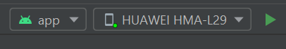

# raising-android

## Table of contents
1. [Initial Setup](#initial)
1. [Start the app on your device](#startDevice)
1. [Start the app on an emulator](#startEmulator)
1. [Further development](#development)
1. [Documentation](#documentation)

## Initial Seutp <a name="initial"/>

1. Install the newest version of [Android Studio](https://developer.android.com/studio)
1. Open this repository in Android Studio
1. Wait for the initial gradle build to finish

## Start the app on your device <a name="startDevice"/>

1. Download any drivers for the Android Device of your choice (Samsung, Huawei, etc), that are needed to connect to a laptop, from their respective website
1. On your device, go to `Developer Options` and enable `USB-Debugging`
1. Connect your chosen device to your laptop via USB-cable and select `Share data` on the Pop-Up-Window
1. Open Android Studio and load this repository
1. At the top you will see your connected device, click on the green arrow on the right to run the app 
1. After about 15 seconds the app automatically opens on your device

## Start the app on an emulator <a name="startEmulator"/>

NOTE: Before using an emulator to start our app, keep in mind, that the emulator is pretty hungry for hardware resources and can quickly overload your system. We therefore recommend, that you start our app on a connected device.

1. Click here, to start with the setup of your emulator. -- Bild --
1. A new window opens, click on `Create virtual device..`. You can now select a phone of your choice. We recommend, that you use either `Pixel 3` oder `Nexus 5` for this application.
1. In the next window you can select an API Level for your emulator. We recommend, that you use API Level 27 or higher. Click on `Download`to install the operating system on your virtual device.
1. After everything is installed, which may take about 5 minutes, you can give your new emulator a name, and then hit `Finish`to finish the installation.
1. Your can now use your emulator to start our app by selecting it and clicking on the green arrow next to it.

## Further development <a name="development"/>

Our inline code documentation should help you to get started.
For additional information visit [Android documentations](https://developer.android.com/docs).

## Documentation <a name="documentation"/>

If you want to create the newest documentation of our project, follow these steps:
1. In Android Studio, open the `Tools` menu and select `Generate JavaDoc..`
1. Enter your prefered scope and a directory, where the generated files should be stored
1. Also tick the box `Open generated documentation in browser`
